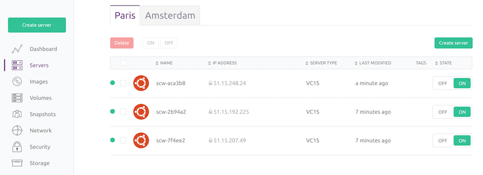
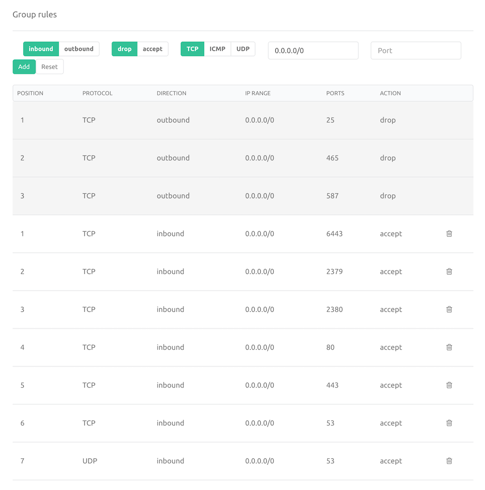
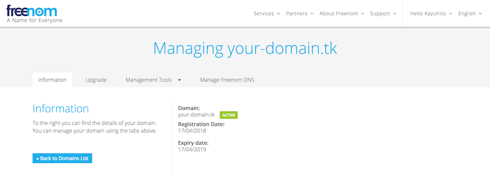
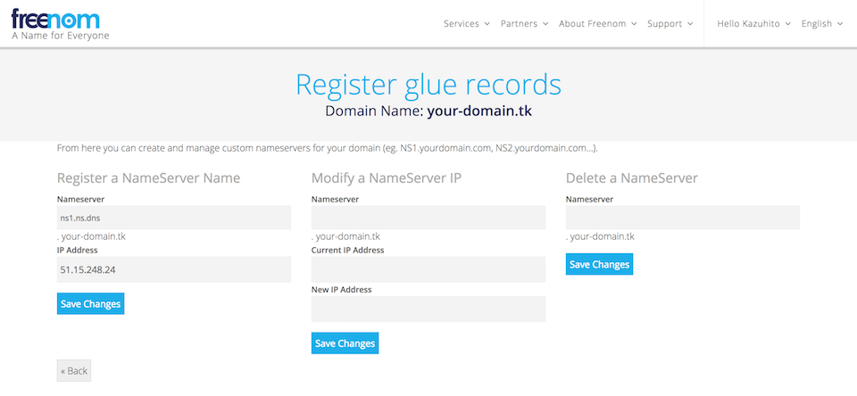
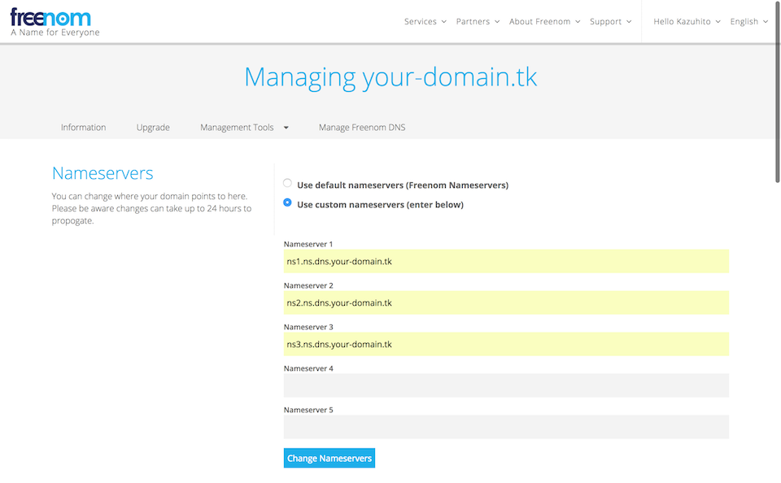
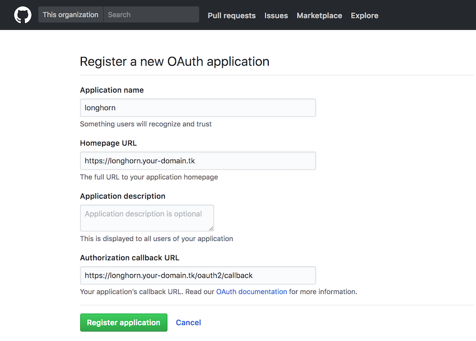
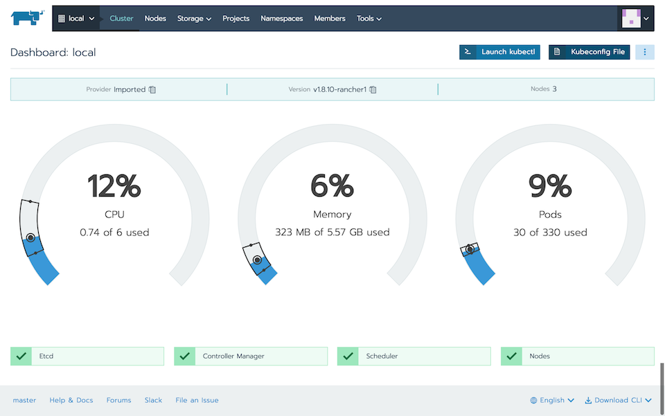
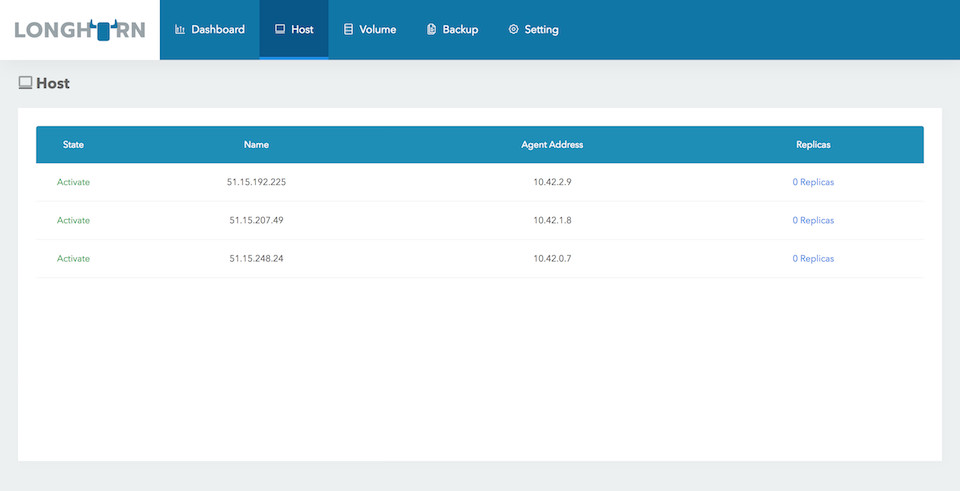

# kube-assembler
Assemble SSL/TLS enabled kubernetes cluster powered by [rancher/rke](https://github.com/rancher/rke)

## Developer Experience

### 1. Create servers

- Select node spec (e.g. [scaleway](https://www.scaleway.com/))
    - Server Type #=> VC1S (2 X86 64bit Cores, 2GB memory, 200Mbit/s Unmetered)
    - Image #=> Ubuntu Xenial (16.04 latest)
    - Storage #=> 50GB LSSD
- Start 3 nodes
    - SSH_KEY_PATH #=> `${HOME}/.ssh/id_rsa`
    - HOST_USER #=> `root`
    - NODE01 #=> `1.1.1.1`
    - NODE02 #=> `2.2.2.2`
    - NODE03 #=> `3.3.3.3`
    
- Setup security group
    - tcp #=> 53, 80, 443, 2379, 2380, 6443
    - udp #=> 53
    

### 2. Setup domain

- Select target domain (e.g. [freenom](http://www.freenom.com/))
    - BASE_DOMAIN #=> `your-domain.tk`
    
- Register glue records
    - ns1.ns.dns.`your-domain.tk` #=> `1.1.1.1`
    - ns2.ns.dns.`your-domain.tk` #=> `2.2.2.2`
    - ns3.ns.dns.`your-domain.tk` #=> `3.3.3.3`
    
- Use custom nameservers 
    - Nameserver 1 #=> ns1.ns.dns.`your-domain.tk`
    - Nameserver 2 #=> ns2.ns.dns.`your-domain.tk`
    - Nameserver 3 #=> ns3.ns.dns.`your-domain.tk`
    

### 3. Setup OAuth App

- Register a new OAuth application to YOUR_GITHUB_ORG
    - Open #=> https://github.com/organizations/${YOUR_GITHUB_ORG}/settings/applications/new
    - Application name #=> `longhorn`
    - Homepage URL #=> https://longhorn.${BASE_DOMAIN}
    - Authorization callback URL #=> https://longhorn.${BASE_DOMAIN}/oauth2/callback
    

- Confirm OAuth application info
    - YOUR_GITHUB_ORG #=> `your-org`
    - LONGHORN_CLIENT_ID #=> `longhorn_client_id`
    - LONGHORN_CLIENT_SECRET #=> `longhorn_client_secret`

### 4. Run kube-assembler

- Feed values
    ```
    $(cat <<EOL
    export HOST_USER=root
    export NODE01=1.1.1.1
    export NODE02=2.2.2.2
    export NODE03=3.3.3.3
    export SSH_KEY_PATH=${HOME}/.ssh/id_rsa
    export YOUR_DOMAIN=your-domain.tk
    export YOUR_GITHUB_ORG=your-org
    export RANCHER=true
    export LONGHORN_CLIENT_ID=longhorn_client_id
    export LONGHORN_CLIENT_SECRET=longhorn_client_secret
    export MAINTENABILITY=true
    export WEAVE_CLIENT_ID=weave_client_id
    export WEAVE_CLIENT_SECRET=weave_client_secret
    EOL)
    ```

- Assemble!
    ```
    docker run -it \
    -v certs:/etc/letsencrypt \
    -v kube-assembler:/usr/local/src/kube-assembler \
    -e "HOST_USER=${HOST_USER}" \
    -e "TARGET_HOSTS=${NODE01},${NODE02},${NODE03}" \
    -v ${SSH_KEY_PATH}:/root/.ssh/id_rsa \
    -e "BASE_DOMAIN=${YOUR_DOMAIN}" \
    -e "GITHUB_ORG=${YOUR_GITHUB_ORG}" \
    -e "RANCHER=${RANCHER}" \
    -e "LONGHORN_CLIENT_ID=${LONGHORN_CLIENT_ID}" \
    -e "LONGHORN_CLIENT_SECRET=${LONGHORN_CLIENT_SECRET}" \
    -e "MAINTENABILITY=${MAINTENABILITY}" \
    -e "WEAVE_CLIENT_ID=${WEAVE_CLIENT_ID}" \
    -e "WEAVE_CLIENT_SECRET=${WEAVE_CLIENT_SECRET}" \
    capsulecloud/kube-assembler
    ```

It takes about 30 minutes!

### 5. Enjoy!

- rancher #=> open https://rancher.${BASE_DOMAIN}/


- longhorn #=> open https://longhorn.${BASE_DOMAIN}/


## Comming Soon!

- kubernetes-dashboard
- weave-scope
- openfaas
- minio
- gogs
- drone
- registry2
